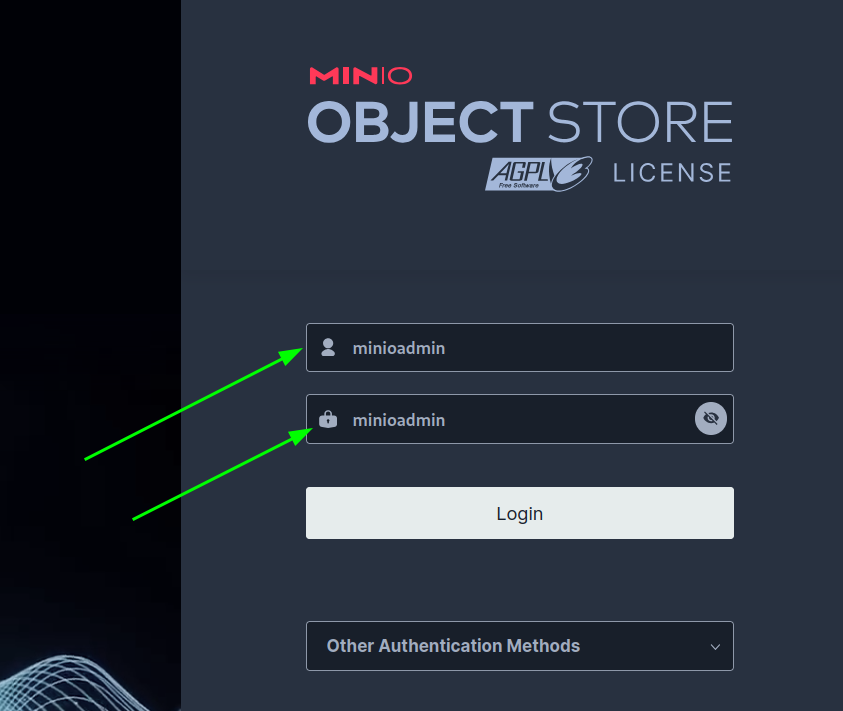
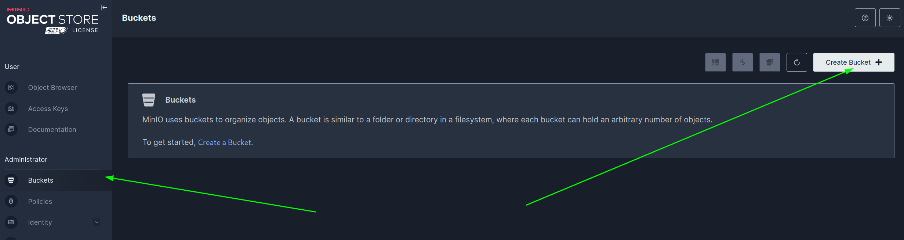
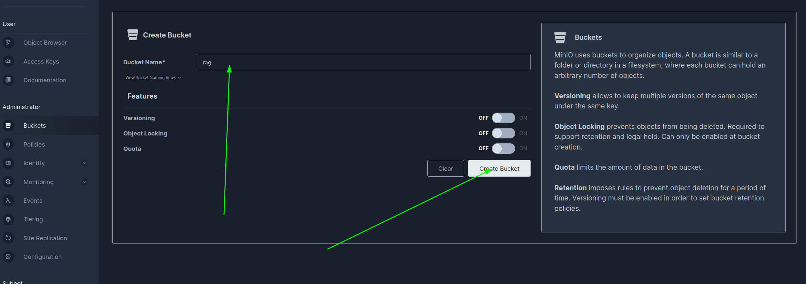
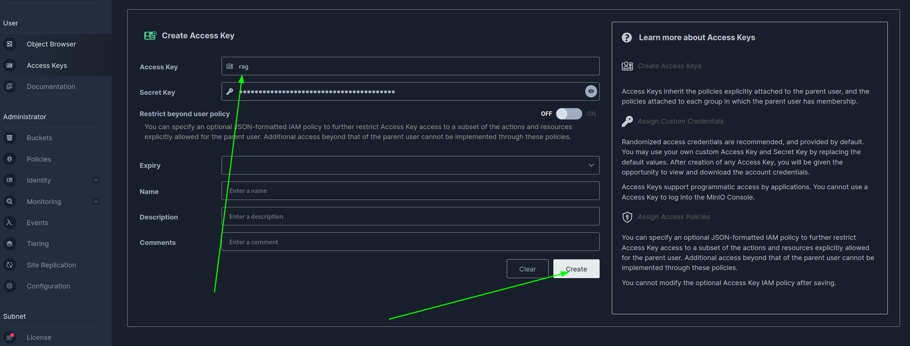

# Perplexity-based text chunker

## Prerequisites

- Python 3.10+
- PyTorch 2.0+

## Installation
```sh
copy .env.example .env
# pytorch with cuda support if you have an Nvidia GPU and CUDA
pip install torch torchvision torchaudio --index-url https://download.pytorch.org/whl/cu121
pip install -r requirements.txt

docker compose up
```

### Minio manual configuration
1. Open http://localhost:9001
1. Login and password is ```minioadmin```  

1. Open buckets tab and create new one with name ```rag```


1. Open access keys tab and create access key with name ```rag```

1. Paste key into .env into field ```AWS_ACCESS_KEY_SECRET```
### Postgresql manual configuration
1. Connect to pg ```jpsql -h localhost -p 5432 -U user -d vectordb```, default password is ```password```
1. Execute ```"CREATE EXTENSION vector;"```
### Manually downloading nltk wordlists
1. Enter python executing ```python```
1. Execute commands
```py
from nltk import download
download('punkt_tab')
```
### Start app
1. ```cd app```
1. ```uvicorn "main:app" --port 8000 --reload```
1. Open http://localhost:8000/docs#/